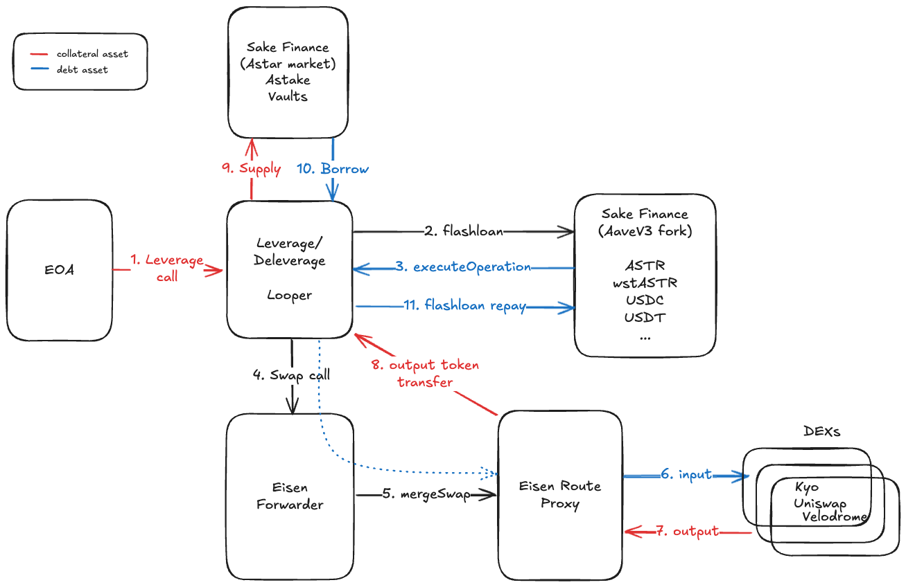

# Leverage Loop using Eisen Labs FlashLoan Router

A comprehensive leverage loop implementation using flashloans via Eisen Labs' swap API router and Aave V3 fork integration.

## Overview

This project implements a leverage loop strategy that allows users to increase their exposure to assets using flashloans. The system leverages Eisen Finance's swap infrastructure and Aave V3 for efficient capital deployment across multiple networks including Base, Soneium, and Ethereum.



### How the Leverage Loop Works

The leverage loop mechanism allows users to amplify their position by recursively borrowing against their collateral. Here's the step-by-step process:

#### 🔄 **Leverage Loop Process**

1. **Initial Setup**

   - User deposits initial collateral (e.g., 1 ETH)
   - User approves credit delegation to LeverageLoop contract
   - User sets target leverage multiplier (e.g., 3x)

2. **Flashloan Initiation**

   - Contract calculates optimal flashloan amount via Eisen Finance API
   - Initiates flashloan through Aave V3 Pool
   - Receives borrowed assets (e.g., USDC) in flashloan callback

3. **Swap Execution**

   - Uses Eisen Finance router to swap borrowed assets to collateral asset
   - Applies slippage protection and optimal routing
   - Receives additional collateral tokens

4. **Collateral Supply**

   - Supplies both initial + swapped collateral to Aave V3
   - Increases user's collateral position
   - Enables borrowing capacity expansion

5. **Borrowing & Repayment**
   - Borrows exact amount needed to repay flashloan + premium
   - Repays original flashloan automatically
   - User retains leveraged position

#### 📈 **Result: Amplified Exposure**

- Initial: 1 ETH exposure
- After 3x leverage: ~3 ETH exposure with same initial capital
- Maintains healthy collateralization ratio
- User benefits from amplified price movements

#### 🔄 **Deleverage Process**

1. **Position Assessment**

   - Calculate optimal deleverage amount
   - Determine collateral to withdraw for debt repayment

2. **Flashloan for Deleverage**

   - Flashloan collateral asset amount
   - Swap to debt asset via Eisen Finance
   - Repay user's debt on Aave V3

3. **Collateral Withdrawal**

   - Transfer user's aTokens to contract
   - Withdraw underlying collateral from Aave
   - Repay flashloan from withdrawn collateral

4. **Return Excess**
   - Return any excess collateral to user
   - Position is successfully deleveraged

### Key Components

1. **LeverageLoop.sol** - Main contract executing leverage/deleverage strategies
2. **Eisen Finance Integration** - Optimal swap routing and liquidity aggregation
3. **Aave V3 Integration** - Lending, borrowing, and collateral management
4. **Multi-Network Support** - Base, Soneium, Ethereum with network-specific optimizations

## Features

### 🚀 **Core Functionality**

- ✅ **Leverage Loop Execution** - Automated leverage amplification using flashloans
- ✅ **Deleverage Operations** - Safe position reduction and unwinding
- ✅ **Aave V3 Integration** - Direct protocol interaction for lending/borrowing
- ✅ **Eisen Finance API** - Real-time swap quotes and optimal routing

### 🌐 **Multi-Network Support**

- ✅ **Base Network** - Primary deployment with gas optimizations
- ✅ **Soneium Network** - Native integration with enhanced performance
- ✅ **Ethereum Mainnet** - Full feature set with maximum liquidity
- ✅ **Cross-Network Testing** - Comprehensive validation across all networks

### 🔧 **Advanced Features**

- ✅ **Dynamic Parameter Calculation** - Optimal flashloan and leverage amounts
- ✅ **Slippage Protection** - Automatic slippage tolerance and validation
- ✅ **Safety Validations** - Health factor monitoring and risk assessment
- ✅ **Emergency Functions** - Owner-controlled emergency withdrawal and controls

### 🧪 **Testing & Development**

- ✅ **Fork Testing Suite** - Real network testing with actual protocols
- ✅ **Mock Implementations** - Complete mock APIs for development
  - `MockAaveV3Pool.sol`: simulates flashloans and pool interactions used by `LeverageLoop`
  - `MockEisenRouter.sol`: simulates swap calls with an event for observability
- ✅ **Gas Analysis Tools** - Cross-network gas cost comparisons
- ✅ **Batch Operations** - Multiple quotes and complex operation testing

## Architecture

```
                    User (EOA)
                       ↓
               ┌─────────────────┐
               │  LeverageLoop   │ ←──── Owner Controls
               │    Contract     │       (Emergency Functions)
               └─────────────────┘
                  ↓           ↓
         ┌─────────────┐ ┌─────────────┐
         │ Aave V3 Pool│ │Eisen Finance│
         │             │ │   Router    │
         └─────────────┘ └─────────────┘
              ↓               ↓
    ┌─────────────────┐ ┌─────────────┐
    │ aTokens/Debt    │ │ Swap Routes │
    │   Management    │ │& Liquidity  │
    └─────────────────┘ └─────────────┘
```

### Multi-Network Architecture

The system is deployed across multiple networks with network-specific optimizations:

- **Base Network**: Primary deployment with optimized gas costs
- **Soneium Network**: Native integration with enhanced performance
- **Ethereum Mainnet**: Full feature set with maximum liquidity

## Usage

### 1. Deploy Contracts

```shell
# Set environment variables
export PRIVATE_KEY=your_private_key_here
export RPC_URL=your_rpc_url_here

# Deploy contracts
forge script script/Deploy.s.sol:DeployScript --rpc-url $RPC_URL --broadcast --verify
```

### 2. Execute Leverage Loop

```solidity
// Example: 3x leverage on WETH using USDC as borrow asset
// First approve collateral to the contract
IERC20(WETH_ADDRESS).approve(leverageLoopAddress, 1 ether);

// Get aToken and variable debt token addresses from Aave
(address aWETH, , address variableDebtUSDC) = protocolDataProvider
    .getReserveTokensAddresses(WETH_ADDRESS);

// Build swap data using Eisen Finance API
bytes memory swapData = eisenApi.buildSwapData(
    USDC_ADDRESS,    // fromToken
    WETH_ADDRESS,    // toToken
    flashloanAmount, // amount
    recipient        // recipient
);

LeverageLoop.LeverageParams memory params = LeverageLoop.LeverageParams({
    aToken: aWETH,
    variableDebtAsset: variableDebtUSDC,
    collateralAsset: WETH_ADDRESS,
    borrowAsset: USDC_ADDRESS,
    collateralAmount: 1 ether,
    flashloanAmount: 2000 * 1e6, // Calculated optimal amount
    swapPathData: swapData
});

leverageLoop.executeLeverageLoop(params);
```

### 3. Execute Deleverage

```solidity
// Approve aTokens to the contract for withdrawal
IERC20(aWETH).approve(leverageLoopAddress, withdrawAmount);

LeverageLoop.DeleverageParams memory params = LeverageLoop.DeleverageParams({
    aToken: aWETH,
    collateralAsset: WETH_ADDRESS,
    borrowAsset: USDC_ADDRESS,
    repayAmount: 1500 * 1e6, // USDC debt to repay
    flashloanAmount: 1 ether, // WETH to flashloan
    withdrawCollateralAmount: 1 ether, // aWETH to withdraw
    swapPathData: deleverageSwapData
});

leverageLoop.executeDeleverageLoop(params);
```

### 4. Credit Delegation Setup

```solidity
// User must approve credit delegation before leverage
IVariableDebtToken variableDebtToken = IVariableDebtToken(variableDebtUSDC);
variableDebtToken.approveDelegation(leverageLoopAddress, 10000 * 1e6);

// Enable collateral usage
IAaveV3Pool(aavePool).setUserUseReserveAsCollateral(WETH_ADDRESS, true);
```

## Contract Addresses

### Base Network

- LeverageLoop: `TBD`
- Aave V3 Pool: `0xA238Dd80C259a72e81d7e4664a9801593F98d1c5`
- Protocol Data Provider: `0x2d8A3C5677189723C4cB8873CfC9C8976FDF38Ac`

### Soneium Network

- LeverageLoop: `TBD`
- Aave V3 Pool: `TBD`
- Protocol Data Provider: `TBD`

### Ethereum Mainnet

- LeverageLoop: `TBD`
- Aave V3 Pool: `0x87870Bca3F3fD6335C3F4ce8392D69350B4fA4E2`
- Protocol Data Provider: `0x7B4EB56E7CD4b454BA8ff71E4518426369a138a3`

## Multi-Network Testing

This project includes comprehensive fork testing across multiple networks:

### Quick Start Testing

```bash
# Test on Base network
npm run test:fork:multi

# Test Soneium specifically
npm run test:fork:soneium

# Run all network tests
npm run test:fork:all

# Run enhanced leverage tests
npm run test:leverage
```

### Environment Setup

```bash
# Set RPC URLs for testing
export BASE_RPC_URL="https://mainnet.base.org"
export SONEIUM_RPC_URL="https://rpc.soneium.org"
export ETHEREUM_RPC_URL="https://eth.llamarpc.com"

# Configure test networks
export TEST_NETWORKS="base,soneium"
export USE_MOCK_EISEN_API="true"
```

See [`hh/README.md`](hh/README.md) for detailed testing documentation.

## Development

### Build

```shell
forge build
```

### Test

```shell
forge test -vvv
```

### Test Coverage

```shell
forge coverage
```

### Format Code

```shell
forge fmt
```

### Gas Snapshots

```shell
forge snapshot
```

## Key Components

### LeverageLoop.sol

- **Main Contract**: Executes leverage and deleverage operations
- **Aave V3 Integration**: Direct integration for supply, borrow, repay, withdraw
- **Flashloan Receiver**: Implements `IFlashLoanReceiver` for Aave flashloans
- **Eisen Finance Integration**: Uses Eisen API for optimal swap routing
- **Safety Features**: Comprehensive validation and emergency functions

### Multi-Network Support

- **Network Configurations**: Base, Soneium, Ethereum with network-specific addresses
- **Gas Optimization**: Network-specific gas optimizations and fee calculations
- **Cross-Network Testing**: Comprehensive fork testing across all supported networks

### Eisen Finance Integration

- **v1/quote API**: Real-time swap quotes with optimal routing
- **Mock Implementation**: Complete mock API for testing and development
- **Batch Operations**: Support for multiple quotes and complex swap routes
- **Slippage Protection**: Automatic slippage calculations and validations

### Advanced Testing Framework

- **Fork Testing**: Real network testing with actual protocol interactions
- **Multi-Network Tests**: Cross-network comparisons and validations
- **Leverage Calculations**: Advanced parameter optimization and safety checks
- **Gas Analysis**: Comprehensive gas cost analysis across networks

## Security Considerations

- All contracts include owner-only emergency functions
- Slippage protection on all swaps
- Health factor monitoring for position safety
- Comprehensive input validation
- Reentrancy protection where applicable

## Testing

The project includes comprehensive tests with mock contracts:

- Unit tests for all major functions
- Integration tests for end-to-end flows
- Edge case testing for error conditions
- Mock implementations of external dependencies

## Foundry Commands

### Build

```shell
$ forge build
```

### Test

```shell
$ forge test
```

### Format

```shell
$ forge fmt
```

### Gas Snapshots

```shell
$ forge snapshot
```

### Anvil

```shell
$ anvil
```

### Deploy

```shell
$ forge script script/Deploy.s.sol:DeployScript --rpc-url <your_rpc_url> --private-key <your_private_key>
```

### Cast

```shell
$ cast <subcommand>
```

### Help

```shell
$ forge --help
$ anvil --help
$ cast --help
```

## License

MIT License - see LICENSE file for details.

## Contributing

1. Fork the repository
2. Create a feature branch
3. Add tests for new functionality
4. Ensure all tests pass
5. Submit a pull request

## Support

For questions or support, please open an issue in the GitHub repository.
